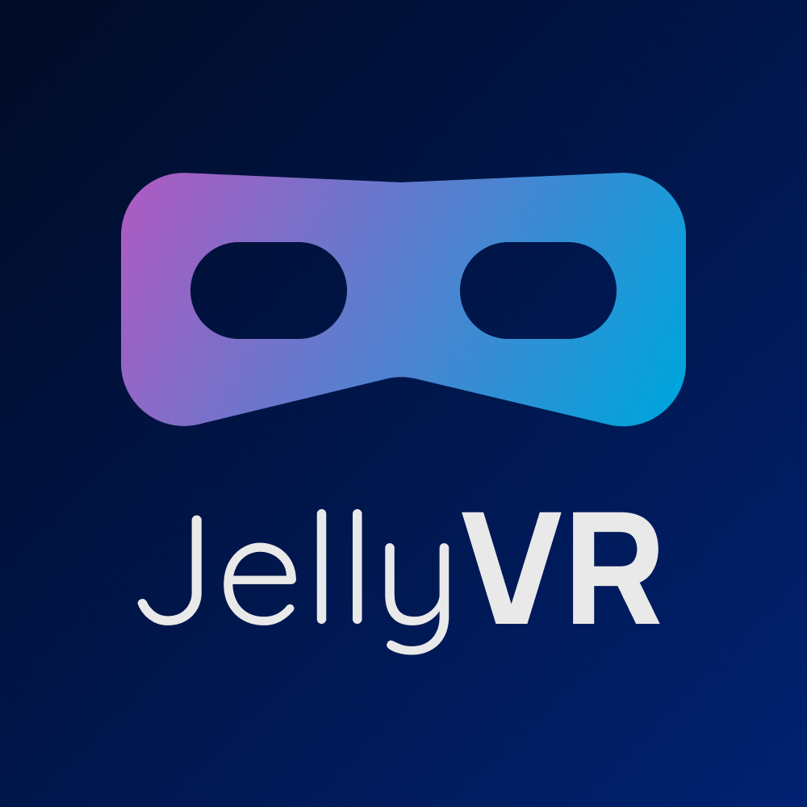
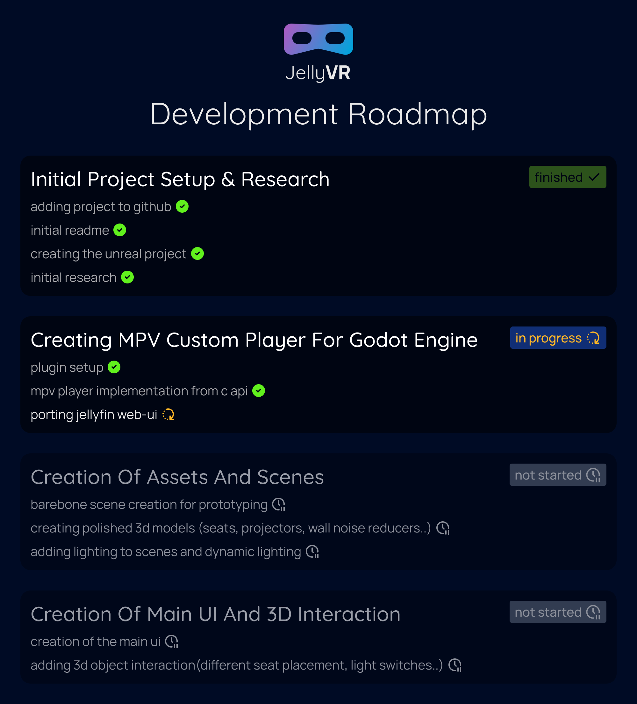

# JellyVR

## Your own VR movie theater for Jellyfin

---
JellyVR is your personal movie theater for Jellyfin, made in Unreal Engine 5 with C++.

---

### FAQ

Where can I get JellyVR ?
> JellyVR is in early development. You can keep up by starring the project on GitHub.

On which headset will this be released ?
> JellyVR will be released on the Meta Quest Store first, then on Steam to support a wider range of headsets.

How can I help ?
> Any help is gladly accepted. Guidelines will follow soon. Feel free to contact me for any inquiries.